# node-mysql

# discription:
In this homework I created a small Amazon-like nodeJS program combined with a Mysql database to simulate an online purchase.

# App components :

in this node js App we used MYSQL and inquirer packages, and MYSQL WORKBENCH to deploy our bamazon database

# Building the App:

### 1 Creating the bamazon database:
the following screenshot shows the command used to create the bamazon database as well as the product table

After populating the product table using the **INSERT INTO table(column1, column2,...) VALUES (value1, value2,...);** the table would look like the following:

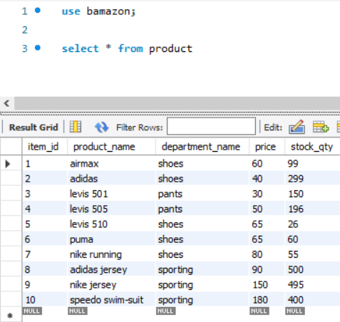

### 
### 2 Connecting to the Bamazon database:

to connect to the bamazon DB we need to install the **mysql** node package then require it in our server.js file (node js code for the app).

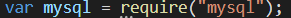

Then we need to use the **crerateConnection** methode of mysql to create a connection object.

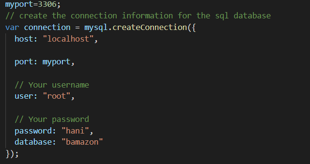

To connect to the DB we use the **connect** methode :

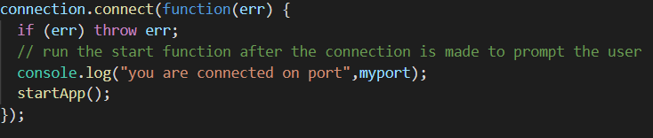

### 3 User interraction and data retreaval: 

when the App starts we will first display the available product from the bamazon DB using the following commands (note that the app starts when we establish the connection with the DB by calling the  **startApp()** Function) :

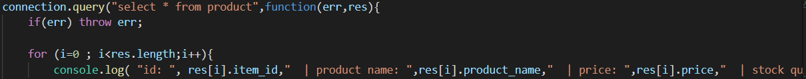

we will then use the inquirer package to prompt the user into entering the id and the quantity of the product he wants to purchase.

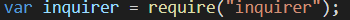

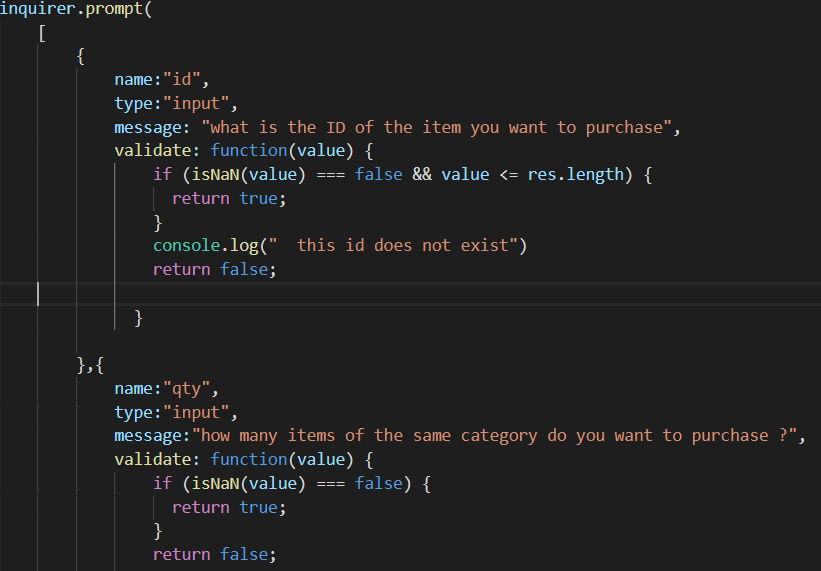

if the user's input an id that doesnt exit in the product table he will be asked to enter the value again.

if the id exists and the user confirms his order, we will store the quantity the id and the qantity of the stock. then we will run the makeOrder() function if the user doesnt confirm it will start the app again.

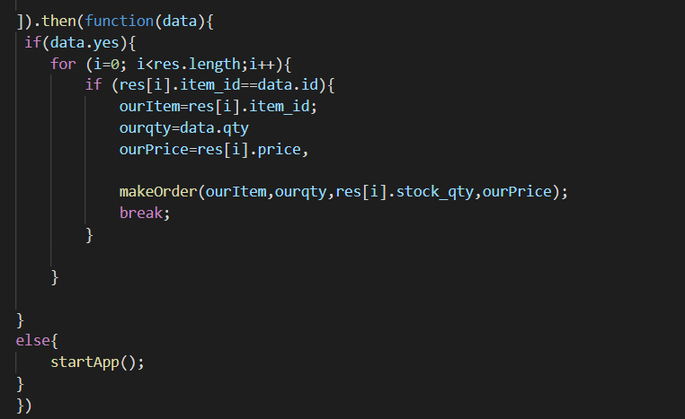

 
 in the makeOrder() function we check if the quantity requested by the user is grather than or qual to the quantity in the stock. if it's not we restart the app by calling the restart fucntion.

**restartApp()**

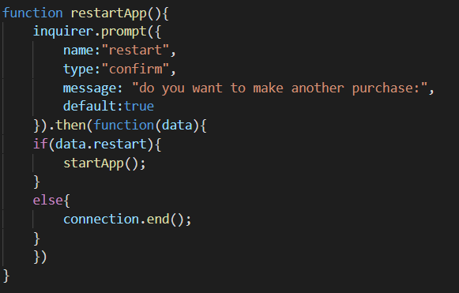

if the quantity is equal or greather than the stock we update the stock quantity on the database. then we calculate the cost of the transaction (price*quantity) and display it to the user befor restarting the App

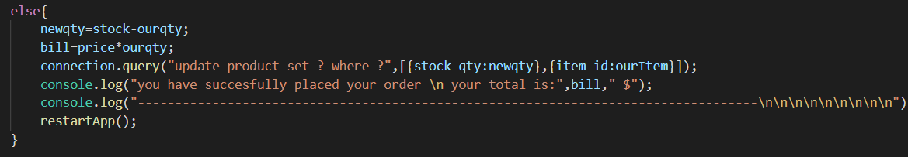

# App Demo:

we run the command **node server.js**

the app will diplay the list of the products available:

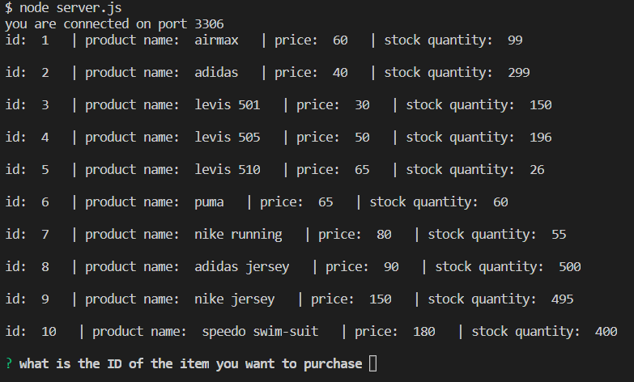

the app will then ask us to enter the ID of the item we want to purchase
if the id we entered does not exist the app will ask us to enter a valid id

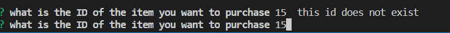

if we enter an existing id the app will prompt us to enter the quantity needed 

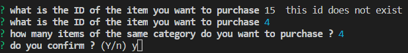

when we confirm the app will check if the there is a sufficient amount of items, if yes the app will display a success message and the total.

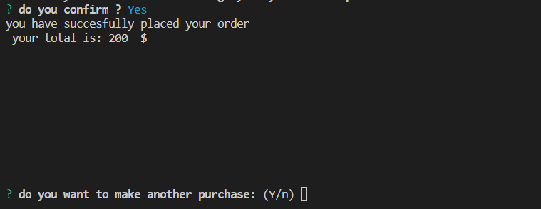

if not, the app will display "the amount of items available for this product is unsufficient" and then prompts us to confirm if we want to try another order.

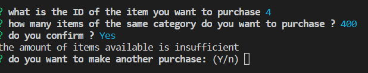